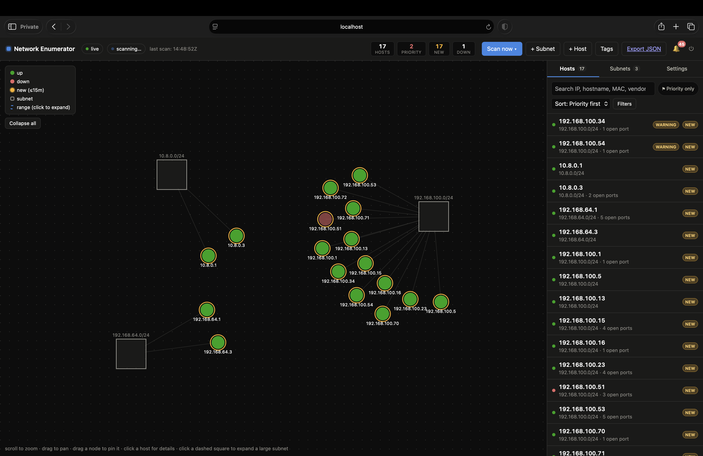
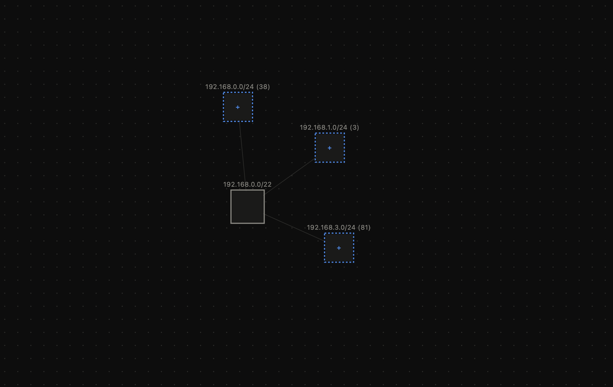
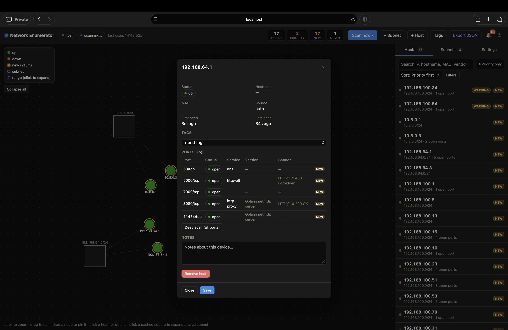
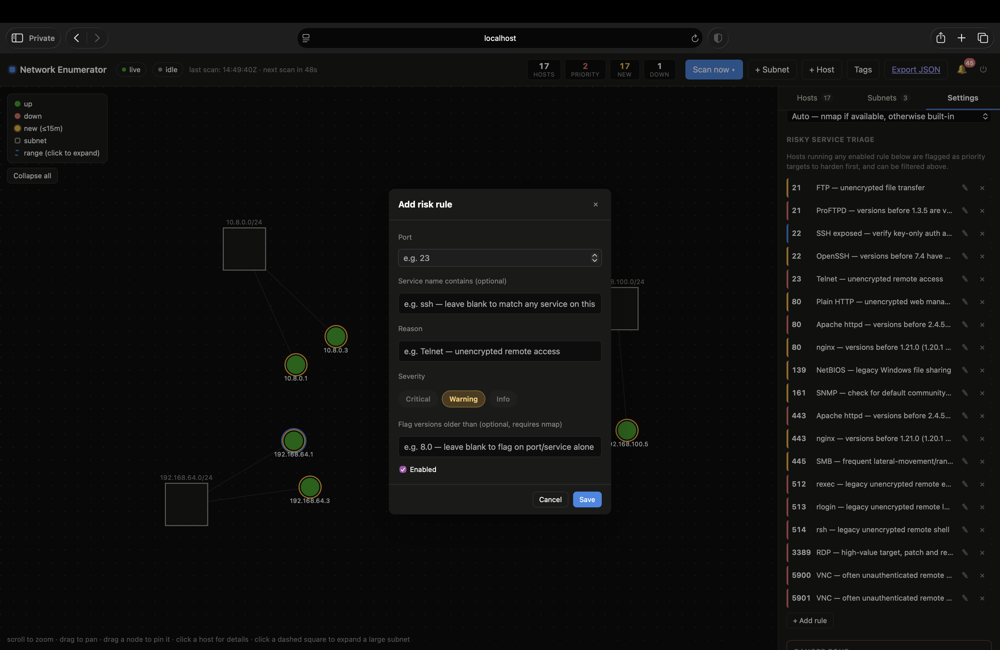

# network-enumerator

A self-contained network discovery and enumeration tool. It runs a background scanner that finds subnets, hosts, and open ports, and serves a live web dashboard to view and triage the results — all from a single static binary with no external dependencies.

> **Authorized use only.** This tool actively probes hosts and ports. Only run it against networks and systems you own or are explicitly authorized to scan.



## What it does

- **Discovers subnets automatically** by inspecting the local machine's network interfaces (`-auto-discover-local`), plus lets you add subnets manually by CIDR. A subnet with a lot of hosts is automatically split into smaller /24 buckets in the graph so it stays readable — click a bucket to expand it into individual hosts:

  

- **Finds hosts** with ICMP and TCP-based probing, and tracks them as up/down over time (a host is marked down after a configurable number of consecutive missed scans).
- **Scans ports** against a curated list of common ports on every cycle, with an on-demand deep scan (all 65535 ports, or a full sweep with version detection) per host or across the whole network. Click any host for its status, tags, open ports (service, version, banner), and notes:

  

- **Uses `nmap` automatically when it's available** on `PATH` for richer results (service/product/version detection via `-sV`), and transparently falls back to a built-in Go TCP/ICMP prober when it isn't — no configuration required, and no root/`CAP_NET_RAW` needed either way.
- **Uses `netdiscover` automatically when it's available**, as a supplementary ARP sweep on subnets the scanner is directly attached to (local L2 segments only — ARP doesn't route). It catches hosts that filter ICMP/TCP but still have to answer ARP (aggressive host firewalls, minimal-stack IoT/OT gear), and gets a MAC vendor lookup for free. On by default, toggleable per-instance from the Scanning section in Settings.
- **Flags risky services** with a configurable risk-rules engine (port + optional service substring + optional "version below X" match → critical/warning/info), and flags suspect hosts (e.g. a MAC address answering for an unusually large number of addresses, typical of proxy ARP or a captive network). Rules ship pre-loaded for common risky services (Telnet, plaintext HTTP, outdated OpenSSH, exposed RDP/VNC, etc.) and are fully editable:

  

- **Serves a live web UI** (dashboard, host list/detail, tagging, acknowledge/triage workflow, risk rules editor, settings) over plain HTTP, pushing updates to connected browsers via Server-Sent Events as scans complete.
- Ships as **one static binary** with the frontend and a SQLite database engine embedded — nothing to install alongside it.

## Running the binary

This is the primary way to use the tool: get the binary, run it, open the web UI.

### Get the binary

- **Download a prebuilt release** from the [Releases page](https://github.com/mophead64/network-enumerator/releases) — binaries are published for Linux (amd64), macOS (arm64), and Windows (amd64).
- **Or build it yourself locally** — see [Building from source](#building-from-source) below.

### Run it

```bash
# Linux/macOS
chmod +x ./network-enumerator-linux-amd64
./network-enumerator-linux-amd64

# Windows
.\network-enumerator-win-amd64.exe
```

By default it listens on port `8080` and keeps everything in memory. Open `http://localhost:8080` in a browser.

On startup it prints a short banner (listening address, scan interval, concurrency settings, whether `nmap` was found, whether data is being persisted) and starts serving requests immediately — scanning also starts right away in the background.

### Log in

The default credentials are:

```
username: admin
password: password1234
```

The login screen (and the startup banner) will keep telling you these are still the default until you change them. Set a real password on first run instead:

```bash
./network-enumerator-linux-amd64 -password 'something-long-and-random'
# or
ADMIN_PASSWORD='something-long-and-random' ./network-enumerator-linux-amd64
```

This only applies the first time — on a fresh database with no credentials yet. Once credentials exist (including on a persisted database from a prior run), use the in-app "change password" flow instead; `-password`/`$ADMIN_PASSWORD` are ignored at that point.

### Persist data across restarts

With no flags, all discovered data lives in an in-memory SQLite database and is lost when the process exits. To keep it:

```bash
./network-enumerator-linux-amd64 -db-file ./enumerator.db
```

### Configuration reference

Every setting is available as both a CLI flag and an environment variable; the environment variable wins if both are set (this is what lets the same binary/image be reconfigured purely through env vars in a container, without a leftover local flag overriding it).

| Flag | Env var | Default | Description |
|---|---|---|---|
| `-port`, `-p` | `PORT` | `8080` | HTTP port to listen on |
| `-db-file` | `DB_FILE` | *(none — in-memory)* | Path to a SQLite file to persist data across restarts |
| `-password` | `ADMIN_PASSWORD` | *(none — uses built-in default)* | Set the initial admin password on first run only |
| `-scan-interval` | `SCAN_INTERVAL_SECONDS` | `60` | Seconds between scan cycles |
| `-host-concurrency` | `HOST_CONCURRENCY` | `128` | Max hosts probed concurrently per subnet |
| `-port-concurrency` | `PORT_CONCURRENCY` | `24` | Max ports probed concurrently per host |
| `-miss-threshold` | `MISS_THRESHOLD` | `3` | Consecutive missed scans before a host is marked down |
| `-auto-discover-local` | `AUTO_DISCOVER_LOCAL` | `true` | Automatically scan subnets attached to local interfaces |
| `-max-hosts-per-subnet` | `MAX_HOSTS_PER_SUBNET` | *(built-in cap)* | Cap on addresses expanded per subnet |

The scan method (auto-detect `nmap` / force `nmap` / force the built-in TCP prober) is set at runtime from the Settings screen in the web UI, not a startup flag.

### Health check

`GET /api/healthz` returns `200 {"status":"ok"}` and requires no authentication — useful for container/orchestrator liveness probes.

## Building from source

Requires Go 1.22+. No CGO and no external dependencies are needed — `CGO_ENABLED=0` produces a fully static binary.

```bash
go build -o enumerator ./cmd/enumerator
./enumerator
```

To cross-compile release binaries for all three platforms at once, use the included script:

```bash
./build.sh
```

This produces `build/network-enumerator-linux-amd64`, `build/network-enumerator-mac-arm64`, and `build/network-enumerator-win-amd64.exe` — the same artifacts published to Releases.

## Running as a container

The `Dockerfile` is a two-stage build: it compiles the static binary in a `golang:1.22-alpine` build stage, then copies just that binary into `gcr.io/distroless/static-debian12:nonroot` — no shell, no package manager, minimal attack surface.

### Build and run locally

```bash
docker build -t network-enumerator .
docker run -p 8080:8080 -e ADMIN_PASSWORD='something-long-and-random' network-enumerator
```

To persist data, mount a volume and point `DB_FILE` at it:

```bash
docker run -p 8080:8080 \
  -e ADMIN_PASSWORD='something-long-and-random' \
  -e DB_FILE=/data/enumerator.db \
  -v enumerator-data:/data \
  network-enumerator
```

### Push to a registry

```bash
docker tag network-enumerator your-registry.example.com/network-enumerator:latest
docker push your-registry.example.com/network-enumerator:latest
```

### Export/import for offline or air-gapped environments

Because the runtime image has no dependency on anything outside the container (static binary, no shell, no package fetches at runtime), it can be built once, saved to a tarball, and carried into an environment with no registry access:

```bash
# On a machine with the source and internet access:
docker build -t network-enumerator .
docker save network-enumerator -o network-enumerator.tar

# Copy network-enumerator.tar into the target environment, then:
docker load -i network-enumerator.tar
docker run -p 8080:8080 network-enumerator
```

## Notes on scanning behavior

- **ICMP**: if the process doesn't have permission to open a raw or unprivileged ICMP socket, ICMP probing is silently disabled and host discovery falls back to TCP-only — logged once at startup, not treated as an error.
- **nmap integration**: when used, it runs a TCP connect scan (`-sT`) against only the hosts the built-in prober already confirmed alive (`-Pn`), which is why it needs no elevated privileges — the same level the built-in TCP prober requires. Install `nmap` and put it on `PATH` and it's picked up automatically; nothing else to configure.
- **netdiscover integration**: only runs against subnets the scanner is directly attached to via a local interface (auto-discovered local subnets have one; manually-added or routed subnets don't, since ARP can't reach across a router). Each scan cycle, its results are unioned into that subnet's alive-host list *before* port scanning — so an ARP-only host (one the TCP/ICMP prober alone would miss entirely) still gets picked up and port-scanned like any other host, not just recorded as "exists." Its MAC/vendor findings only ever fill in what the kernel ARP table or nmap didn't already supply, never overwrite them. Failures (binary missing, sweep errors) are logged and swallowed — it's a supplementary source layered on top of the built-in prober, never the only way a host gets found. Enabled by default when the binary is on `PATH`; toggle it off from Settings if it's not wanted (e.g. to avoid active ARP traffic on a sensitive segment).
- **Risk rules and suspect-host detection** run entirely from data already collected during normal scanning — they don't trigger extra network activity.
